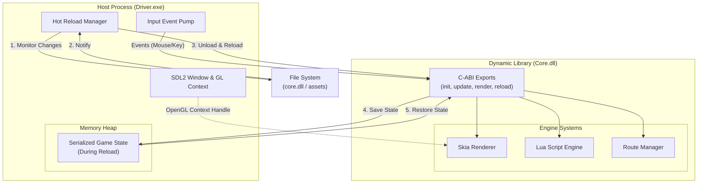
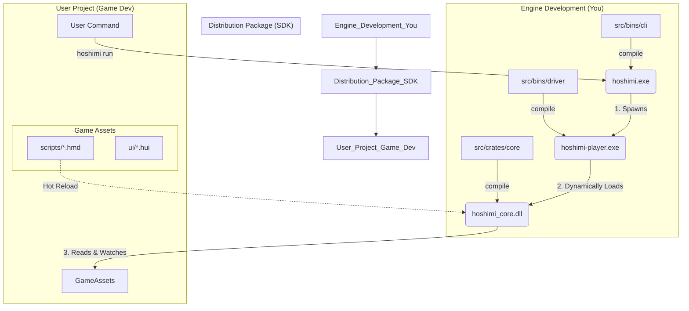

# Hoshimi Engine 架构设计文档 (Architecture Design Document)

## 1. 设计理念 (Design Philosophy)

为了实现极速开发反馈循环（热重载）并提供类似编程语言工具链的用户体验，Hoshimi 引擎采用 **"壳+核" (Driver + Core)** 的分离式架构，并遵循 **运行时优先 (Runtime-First)** 的分发策略。

*   **解耦 (Decoupling)**: 将操作系统层（窗口、输入）与引擎逻辑层（脚本、渲染、UI）分离。
*   **引擎即工具 (Engine as Toolchain)**: 用户不直接修改引擎源码，而是通过 CLI 工具和二进制分发包来初始化和运行项目。
*   **状态保持 (State Persistence)**: 在热重载核心逻辑时，通过序列化手段在内存中保留游戏运行状态。

## 2. 系统架构 (System Architecture)

系统被划分为三个主要部分：CLI 工具、驱动器（Driver）和核心库（Core）。

### 2.1 核心组件职责

| 组件 | 类型 | 路径 | 核心职责 |
| :--- | :--- | :--- | :--- |
| **CLI** | Binary (`.exe`) | `bins/cli` | 项目管理工具。负责 `init` (初始化), `run` (运行), `build` (打包)。类似于 `cargo` 或 `npm`。 |
| **Driver** | Binary (`.exe`) | `bins/driver` | **"壳" (Shell/Player)**。负责 OS 交互（创建 SDL2 窗口）、加载/卸载 Core 动态库、可以看作是游戏的“播放器”。 |
| **Core** | Dynamic Lib (`.dll/.so`) | `crates/core` | **"核" (Kernel)**。包含 Lua VM、Skia 渲染器、路由系统、资源管理。暴露 C-ABI 接口供 Driver 调用。 |

### 2.2 运行时架构图 (Runtime Architecture)



## 3. 目录结构规范 (Directory Structure)

为了支持上述架构，项目将重构为 Rust Workspace 结构：

```text
Hoshimi/                  # 源码仓库根目录
├── Cargo.toml            # Workspace 配置
├── assets/               # 引擎开发测试用的默认资源
├── bins/                 # 二进制入口 crate
│   ├── driver/           # [产物: hoshimi-player.exe]
│   │   ├── Cargo.toml
│   │   └── src/main.rs   # 极简入口，负责加载 DLL
│   └── cli/              # [产物: hoshimi.exe]
│       ├── Cargo.toml
│       └── src/main.rs   # 命令行工具实现
└── crates/               # 库 crate
    ├── core/             # [产物: hoshimi_core.dll]
    │   ├── Cargo.toml    # crate-type = ["cdylib"]
    │   └── src/lib.rs    # 核心逻辑与 C-ABI 导出
    └── shared/           # [可选] Driver 和 Core 共享的类型定义
```

## 4. 用户工作流与分发 (Workflow & Distribution)

引擎发布时，不是提供源码，而是提供类似编译器的工具链包。

### 4.1 分发包内容 (Distribution Package)
*   `bin/hoshimi.exe` (CLI 管理工具)
*   `bin/hoshimi-player.exe` (游戏运行宿主)
*   `lib/hoshimi_core.dll` (引擎核心逻辑)
*   `templates/` (项目初始化模板)

### 4.2 用户开发流程

1.  **初始化 (Init)**:
    用户运行 `hoshimi init my_game`。CLI 从模板复制文件结构。
2.  **开发 (Scripting)**:
    用户在 `my_game/assets/` 下编写 `.hmd` 剧本和 `.hui` 界面。无需编写 Rust 代码。
3.  **运行与调试 (Run)**:
    用户运行 `hoshimi run`。CLI 启动 `hoshimi-player.exe` 并指向用户目录。
    *   此时如果用户修改了脚本，Hoshimi Core 会自动热重载。
    *   如果官方更新了引擎功能，用户只需下载覆盖 `hoshimi_core.dll`。
4.  **构建发布 (Build)**:
    用户运行 `hoshimi build`。CLI 将 Player 复制并重命名为 `MyGame.exe`，打包资源，与 Core DLL 一同放入 `dist/` 目录。

### 4.3 分发流程图



## 5. 关键技术实现细节

### 5.1 动态库接口 (C-ABI)
Core 需要暴露如下样式的 C 接口供 Driver 调用（使用 `libloading` 加载）：

```rust
// crates/core/src/lib.rs

#[no_mangle]
pub extern "C" fn hoshimi_init(config: *const Config) -> *mut EngineState { ... }

#[no_mangle]
pub extern "C" fn hoshimi_update(state: *mut EngineState, events: *const EventObj) { ... }

#[no_mangle]
pub extern "C" fn hoshimi_render(state: *mut EngineState, gl_context: *mut void) { ... }

// 热重载专用：卸载前序列化状态
#[no_mangle]
pub extern "C" fn hoshimi_pre_unload(state: *mut EngineState) -> *mut SerializedData { ... }

// 热重载专用：加载后恢复状态
#[no_mangle]
pub extern "C" fn hoshimi_post_load(data: *mut SerializedData) -> *mut EngineState { ... }
```

### 5.2 状态传递
为了保证热重载（无论是代码重载还是资源重载）不丢失进度，核心数据结构（如 `GameState`, `VariableStore`）必须支持序列化（如使用 `serde` + `bincode`）。
在 reload 发生时：
1.  **Freeze**: 暂停游戏循环。
2.  **Serialize**: Core 将当前关键数据打包成二进制流。
3.  **Transfer**: 二进制流的所有权移交给 Driver。
4.  **Reload**: Driver 卸载旧 DLL，加载新 DLL。
5.  **Deserialize**: Driver 将二进制流传给新 DLL，新 DLL 重建运行状态。
