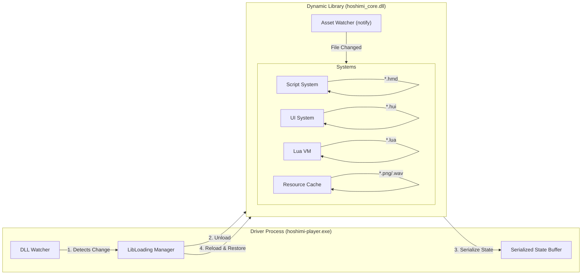

# 热重载设计文档 (Hot Reload Design)

## 1. 概述 (Overview)
本项目的热重载 (Hot Reload) 旨在模仿 Flutter 的开发体验，为创作者提供**亚秒级 (Sub-second)** 的修改反馈。核心目标是允许在不重启引擎、不丢失当前游戏进度（变量、位置、上下文）的情况下，实时更新剧情脚本、UI 布局和逻辑代码。

## 2. 设计原则 (Design Principles)

1.  **状态保持 (State Preservation)**: 热重载不应重置全局变量 (Flags)、当前播放的 BGM、立绘状态或阅读进度。
2.  **即时反馈 (Instant Feedback)**: 利用文件系统监听 (File Watcher) 自动触发，无需手动刷新。
3.  **错误隔离 (Error Isolation)**: 如果热重载的内容包含语法错误，引擎应暂停并显示错误覆盖层 (Overlay)，而不是直接崩溃。

## 3. 架构总览 (Architecture)

为了实现全栈热重载，系统分为 **引擎代码热重载 (Code Reload)** 和 **资源内容热重载 (Asset Reload)** 两个层次。

## 4. 模块详细设计

### 4.0 引擎核心代码热重载 (Core DLL Reload)
这是架构升级的核心。当开发者修改 Rust 源码并重新编译 `hoshimi_core.dll` 时：
1.  **Driver 监听**: 检测到 DLL 文件变化。
2.  **预卸载 (Pre-Unload)**: 调用 Core 的 `hoshimi_pre_unload()`。Core 暂停所有逻辑，将所有关键状态（Lua Global, UI Tree State, Navigation Stack）序列化为二进制 Blob。
3.  **重加载 (Reload)**: Driver 卸载旧 DLL，加载新 DLL，获取新的函数指针。
4.  **恢复 (Post-Load)**: 调用新 Core 的 `hoshimi_post_load(Blob)`。新 Core 反序列化状态，恢复运行。

### 4.1 剧情脚本热重载 (`.hmd`)
Markdown 脚本是游戏的主体。修改对话文本或演出指令应立即反映在当前画面。

*   **监听对象**: `assets/scripts/**/*.hmd`
*   **重载策略**: **锚点定位 (Anchor Relocation)**
    1.  **快照状态**: 记录当前执行到的 行号 (Line Number) 或 区块哈希 (Block Hash)。
    2.  **重新解析**: 重新读取并解析 Markdown 文件，生成新的 AST (抽象语法树)。
    3.  **状态恢复**:
        *   系统尝试在新的 AST 中寻找之前的行号。
        *   如果该行依然存在且是文本行：直接替换显示文本。
        *   如果该行包含逻辑变更 (如跳转指令)：根据设置决定是否重新执行该行逻辑。
        *   如果该行已被删除：回退到上一段落 (Paragraph) 或最近的标签 (Label)。
    4.  **无缝刷新**: 触发一次 `Render` 更新画面。

### 4.2 UI 系统热重载 (`.hui`)
UI 往往需要频繁微调布局参数，是热重载的重点。

*   **监听对象**: `assets/ui/**/*.hui`
*   **重载策略**: **树重建 (Tree Rebuild)**
    1.  **解析**: 解析变更后的 DSL 文件，生成新的 UI 定义结构。
    2.  **Diff/Patch (简易版)**:
        *   对于无状态组件 (Stateless Widgets)：直接销毁旧子树，用新定义的子树替换。
        *   对于有状态组件 (Stateful Widgets，如输入框、滚动列表)：尝试保留状态。
            *   *关键点*: 依靠组件 ID 或 路径 (Path) 来匹配新旧节点。如果在重载前后 ID 匹配，则将旧状态 (Current Value, Scroll Offset) 注入新节点。
    3.  **重绘**: 标记脏区 (Dirty Rect)，下一帧 Skia 重新光栅化。

### 4.3 Lua 逻辑热重载 (`.lua`)
Lua 用于复杂逻辑和扩展。

*   **监听对象**: `assets/scripts/**/*.lua` 和 `plugins/**/*.lua`
*   **重载策略**: **模块清理与重置 (Module Purge & Reload)**
    1.  **清理**: 从 Lua 的 `package.loaded` 中清除变更文件的缓存。
    2.  **重载**: 重新 `dofile` 或 `require` 该文件。
    3.  **生命周期钩子**:
        *   引擎设计 `on_hot_reload()` 回调。插件可以在此回调中重新注册 hook 或刷新数据。
        *   *注意*: 全局变量 (Global Variables) 通常保留在 `_G` 中不被清除，从而实现状态保持。但在模块级别的 `local` 变量会被重置，因此建议脚本编写遵循 **"Code is Logic, Store is State"** 的模式，将状态存在专门的全局表里。

### 4.4 资源热替换 (Assets)
*   **监听对象**: `assets/images/*`, `assets/audio/*`
*   **重载策略**: **热交换 (Hot Swap)**
    *   **纹理 (Texture)**: 保持 Texture ID (Handle) 不变，但在 GPU 显存中重新上传图片数据。所有引用该 ID 的 Sprite 会自动显示新图。
    *   **音频 (Audio)**: 如果该音频正在播放，暂时停止 -> 重新加载 -> 尝试恢复播放位置 (Seek) 或 重新播放 (取决于具体类型，BGM建议恢复，SFX建议重略)。

## 5. 错误处理 (Error Handling)
模仿 Flutter 的 "Red Screen of Death"。

*   **编译/解析错误**: 当 `.hmd` 或 `.hui` 解析失败时 (语法错误)：
    1.  **暂停 Update**: 停止游戏逻辑推进。
    2.  **Overlay**: 在 SDL 窗口最上层绘制一个半透明红色遮罩，显示具体的解析错误信息 (文件名、行号、错误原因)。
    3.  **恢复**: 当用户修复文件并保存后，自动清除错误页并继续运行。

## 6. 技术选型建议
*   **文件监听**: [notify](https://crates.io/crates/notify) (Rust 社区由于跨平台文件监听的标准库)。
*   **资源替换**: 由于使用了 Skia，需要确保 Texture 对象的线程安全更新。
*   **与 Editor 通信**: 未来可扩展 WebSocket 服务，让外部编辑器 (VS Code 插件) 直接推送变更 diff，比文件系统监听更快。
